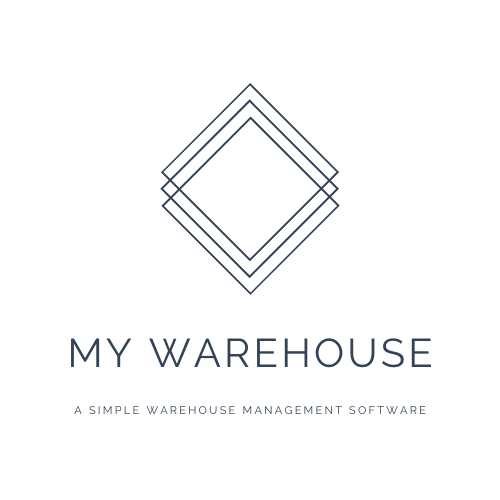

# MyWarehouse-Project

<p align="center">

</p>  

**My Warehouse** is a simple warehouse management software.  
> :heavy_check_mark: Very lightweight and easy to use  
> :heavy_check_mark: Easily select, insert, update and delete data with GUI  
> :heavy_check_mark: Supports exporting data to a CSV file  


## Usage

### Git Clone
```bash 
git clone https://github.com/richeyphu/MyWarehouse-Project.git
```
**Git Pull (git fetch + git merge)**
```bash 
git pull
```
***or***
### Initialize Repository
```bash
repo init -u https://github.com/richeyphu/MyWarehouse-Project.git
```
**Sync Repository**
```bash
repo sync
```


### Required Packages
- [`PyQt5`](https://pypi.org/project/PyQt5/)
- [`PyQt5-stubs`](https://pypi.org/project/PyQt5-stubs/)
- [`pyqt5-tools`](https://pypi.org/project/pyqt5-tools/)


## Development Tools
* **IDE :** [`PyCharm Professional 2021.2`](https://www.jetbrains.com/pycharm/)
* **Interpreter :** [`Python 3.9`](https://www.python.org/downloads/release/python-390/)
* **GUI Framework :** [`PyQt5`](https://pypi.org/project/PyQt5/)+[`Qt Designer`](https://build-system.fman.io/qt-designer-download)
* **DBMS :** [`SQLite3`](https://www.sqlite.org/)


## Docs
- [MyWarehouse's Docs](https://richeyphu.github.io/MyWarehouse-Project/)


>*In partial fulfillment of the requirements for the course `INT-303: Software Engineering (1/2564)`*
